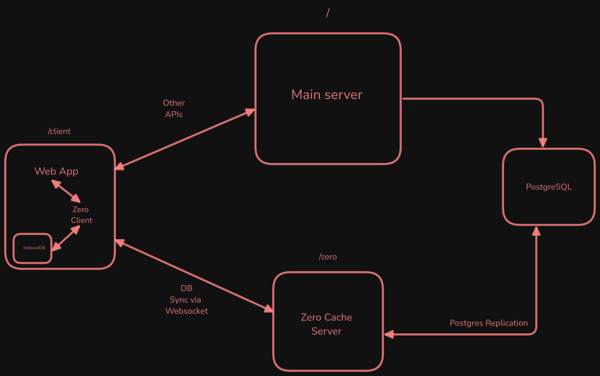

# Local First App using Nest.js & Zero Sync

A simple offline-first To-Do app using [ZeroSync](https://zero.rocicorp.dev/).


## Architecture:



### Steps to run:

**1. Run dev servers:**
This will spin up the main Postgres database, API server and zero cache server.

```
pnpm docker:dev:up
```

**2. Run Migrations:**

```
docker exec -it nestjs-boilerplate-server sh
pnpm migration:up
```

This will migrate the required tables and adds `todo` table to the zero publication. After the migration, zero cache server will have access to todo table and will start syncing.
NOTE: Only allow tables that needs to be synced to the client in publication. Tables holding user sensitive information like `user` in our case should not be added to publication.

**3. Run client:**

```
cd client
pnpm start:dev
```

This setup uses [Ultimate Nest.js Boilerplate](https://github.com/niraj-khatiwada/ultimate-nestjs-boilerplate) for API.
